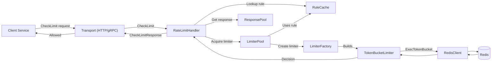
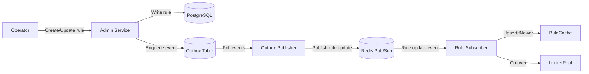

# The Distributed Rate Limiter: A Bird's Eye View

Let me tell you the story of how this system works, from 30,000 feet up.

---

## The Two Main Storylines

This system has **two parallel stories** happening simultaneously:

1. **The Hot Path Story** - Millions of requests per second flowing through, getting approved or rejected
2. **The Control Plane Story** - Operators updating rules, changes propagating across the world

Think of it like an airport: planes landing and taking off every minute (hot path), while behind the scenes, air traffic controllers update flight rules and runway assignments (control plane).

---

## Act 1: The Hot Path - "Can I Make This Request?"

### The Characters

**The Client Service** (outside our system)

- A web application serving users
- Before making an expensive operation (API call, database query), it asks: "Am I allowed?"

**The Rate Limit Service** (our main character)

- Lives in every region (US-East, EU-West, Asia-Pacific)
- Each region has multiple instances behind a load balancer
- Makes instant decisions: "Yes, you can proceed" or "No, slow down"

**Redis** (the memory keeper)

- Lives in each region
- Remembers: "User Alice from Tenant Acme has made 47 requests in the last minute"
- Updates these numbers **atomically** using Lua scripts

**The Rules** (the law of the land)

- Stored as records: "Tenant Acme, Resource /api/search: 100 requests per minute, token bucket algorithm"
- Each instance keeps these rules **in memory** for instant access

---

### The Journey of a Single Request

**Morning, 9:47 AM, US-East region:**

A request arrives at one of our instances:

```
"TenantID: acme, UserID: alice, Resource: /api/search, Cost: 1"
```

**Step 1: The Transport Receives It**

The Transport is like a receptionist. It could be answering the phone (HTTP) or reading faxes (gRPC). It doesn't care about rate limiting logic—it just unpacks the message and hands it to the **RateLimitHandler**.

**Input**: Raw HTTP/gRPC request  
**Output**: Calls `RateLimitHandler.CheckLimit()`

---

**Step 2: The Handler Looks Up The Rule**

The **RateLimitHandler** is like a judge who needs to know what law applies. It asks the **RuleCache**: "What's the rule for Acme's /api/search endpoint?"

The **RuleCache** responds instantly (it's all in memory):

```
"Algorithm: token_bucket, Limit: 100, Window: 60s, Burst: 120"
```

**Input**: TenantID + Resource  
**Output**: A Rule object (or "not found")  
**Who it talks to**: RuleCache (memory lookup, no network)

---

**Step 3: The Handler Gets a Limiter**

Now the handler needs a worker who knows how to enforce token bucket rules. It asks the **LimiterPool**: "Give me a limiter for Acme's /api/search."

The **LimiterPool** is like a tool library. It checks:

- "Do I already have a token bucket limiter for this tenant-resource combination?"
- If yes: "Great, check it out" (increment a reference counter)
- If no: "Let me create one using the **LimiterFactory**"

The LimiterFactory builds a **TokenBucketLimiter** configured with the rule parameters.

**Input**: TenantID + Resource  
**Output**: A LimiterHandle (like checking out a book from a library)  
**Who it talks to**:

- RuleCache (to get the current rule)
- LimiterFactory (to create new limiters)
- Internal LRU cache (to avoid creating limiters over and over)

---

**Step 4: The Limiter Checks Redis**

The **TokenBucketLimiter** now does the actual work. It builds a Redis key:

```
"ratelimit:acme:alice:/api/search"
```

It then calls **RedisClient.ExecTokenBucket()** with:

- The key
- The rule parameters (limit=100, window=60s)
- The cost (1 token)

**Inside Redis**, a Lua script runs **atomically**:

1. "What time is it?" (Redis TIME command)
2. "How many tokens does Alice have right now?"
3. "Refill tokens based on time elapsed since last request"
4. "Can I deduct 1 token?"
5. If yes: "Deduct it, return allowed=true, remaining=46"
6. If no: "Return allowed=false, retryAfter=5 seconds"

**Input**: Key, rule params, cost  
**Output**: A Decision (allowed/denied + metadata)  
**Who it talks to**: Redis (network call, but sub-millisecond in the same region)

---

**Step 5: The Handler Responds**

The handler receives the decision from Redis and:

- Grabs a **response object from a pool** (to avoid allocations)
- Fills it with: `Allowed=true, Remaining=46, Limit=100, ResetAfter=14s`
- Hands it back to the Transport

**Input**: Decision from limiter  
**Output**: CheckLimitResponse  
**Who it talks to**: ResponsePool (memory)

---

**Step 6: The Transport Sends It Back**

The transport serializes the response (JSON for HTTP, protobuf for gRPC) and sends it to the client service.

The client service sees: "Allowed! I can make my database query."

**Input**: CheckLimitResponse  
**Output**: HTTP 200 with JSON body

---

### What Happens When Things Go Wrong?

**If Redis is down:**

The **DegradeController** notices Redis health checks failing. After a threshold (say, 5 seconds), it switches the system to **ModeDegraded**.

Now when a limiter tries to call Redis and gets an error:

1. The **CircuitBreaker** (inside DegradeController logic) opens
2. The limiter falls back to the **FallbackLimiter**

The **FallbackLimiter** is like an emergency backup generator:

- It checks: "Am I the **owner** of this key?" (using **RendezvousOwnership**)
- Ownership uses consistent hashing on the membership list: "Given 10 instances and this key, which instance should handle it?"
- If this instance is the owner: Use a **local in-memory limiter** with scaled-down limits
  - Example: Global limit is 100/min across 10 instances → Local limit is 10/min
- If not the owner: **Deny the request** (to prevent 10x multiplied limits)

**Input**: Redis failure  
**Output**: Degraded mode activated, requests use local limiters  
**Who it talks to**:

- Membership (to get list of instances)
- LocalLimiterStore (in-memory token buckets per key)



---

## Act 2: The Control Plane - "I Need to Change a Rule"

### The Characters

**The Operator** (human or automation)

- Decides: "Tenant Acme is getting hammered, let's increase their limit from 100 to 500/min"

**The Admin Service**

- Accepts rule change requests
- Validates them
- Persists them durably

**PostgreSQL** (the source of truth)

- **Primary database** in one region (say, US-East)
- **Read replicas** in every region
- Stores all rules with version numbers

**The Outbox**

- A special table in Postgres
- Ensures rule changes are **published reliably** to all instances

**Redis Pub/Sub**

- A fast message bus
- Broadcasts invalidation events to all instances in all regions

**The Rule Cache**

- Needs to stay in sync with the database
- Updated via two mechanisms: fast (invalidation) and slow (full sync)

---

### The Journey of a Rule Change

**10:00 AM: The Operator Updates a Rule**

An API call arrives at the **AdminHandler**:

```
UpdateRule: TenantID=acme, Resource=/api/search, Limit=500 (was 100), ExpectedVersion=7
```

**Step 1: Validate and Persist**

The AdminHandler calls **RuleDB.Update()** with optimistic locking:

**Inside Postgres** (primary):

```sql
UPDATE rules
SET limit = 500, version = version + 1, updated_at = NOW()
WHERE tenant_id = 'acme'
  AND resource = '/api/search'
  AND version = 7
RETURNING *;
```

If `version` doesn't match (someone else updated it), the transaction fails. If it succeeds:

- The rule is now version 8
- **In the same transaction**, a row is inserted into the **outbox table**:

```sql
INSERT INTO outbox (id, channel, payload)
VALUES (uuid(), 'rule_changes', '{"tenant":"acme","resource":"/api/search","action":"upsert","version":8}');
```

**Why the outbox?** If the database commits but the app crashes before publishing to Redis Pub/Sub, we need a durable record to retry later.

**Input**: Update request  
**Output**: Updated rule (version 8), outbox row created  
**Who it talks to**: PostgreSQL primary

---

**Step 2: The Outbox Publisher Wakes Up**

Every 100ms, the **OutboxPublisher** runs:

1. "Are there any unsent messages in the outbox?"
2. Fetches up to 100 rows
3. For each row, publishes to **PubSub.Publish()** on channel `rule_changes`
4. Marks the row as sent

**Input**: Polling timer  
**Output**: Messages published to Redis Pub/Sub  
**Who it talks to**:

- Outbox table (Postgres)
- Redis Pub/Sub

---

**Step 3: Instances Receive the Invalidation**

Every instance in every region is subscribed to the `rule_changes` channel via **CacheInvalidator.Subscribe()**.

When the message arrives:

```json
{
  "tenant": "acme",
  "resource": "/api/search",
  "action": "upsert",
  "version": 8
}
```

The **CacheInvalidator** springs into action:

1. "This is an upsert event. Let me fetch the latest rule."
2. Calls **RuleDB.Get()** to the **local read replica**
3. Receives the updated rule (version 8, limit 500)
4. Calls **RuleCache.UpsertIfNewer()**: "Only update if version > current"
5. The RuleCache compares: "I have version 7, this is version 8" → Updates in memory

**Then, the critical step:**

6. Calls **LimiterPool.Cutover()**: "We need to switch to the new rule"

**Input**: Invalidation event from Pub/Sub  
**Output**: RuleCache updated, limiter cutover initiated  
**Who it talks to**:

- RuleDB (read replica)
- RuleCache (in-memory)
- LimiterPool (in-memory)

---

**Step 4: The Cutover (The Delicate Dance)**

The **LimiterPool** receives the cutover signal for `acme + /api/search`.

It finds the existing limiter (version 7, limit 100) and:

1. **Marks it as Quiescing** (state transition: Active → Quiescing)
   - New requests trying to acquire this limiter see "quiescing" and **wait** or create a new one
2. **Waits for in-flight requests to drain** (up to the quiesce window, say 2 seconds)

   - The limiter has a reference counter tracking how many requests are using it
   - Waits until `refs == 0` or timeout expires

3. **Removes it from the pool's map**

   - Future requests will trigger creation of a new limiter (version 8, limit 500)

4. **Closes the old limiter**
   - Releases any resources (though limiters are mostly stateless—Redis holds the state)

**Input**: TenantID + Resource + NewVersion  
**Output**: Old limiter quiesced and removed, new limiters will be created on-demand  
**Who it talks to**: Internal state (reference counters, state machine)

---

**Step 5: Next Request Uses New Limits**

At 10:00:02 (2 seconds later), a new request for `acme + /api/search` arrives.

The handler asks the **LimiterPool** for a limiter. The pool:

1. "I don't have one in my cache (we removed the old one)"
2. Fetches the rule from **RuleCache** → version 8, limit 500
3. Calls **LimiterFactory.Create()** → builds a new **TokenBucketLimiter** with limit 500
4. Caches it for future requests

**The first request with the new limiter goes to Redis and the Lua script now uses limit=500.**



---

### The Safety Net: Full Sync

What if:

- The invalidation message is lost?
- The read replica is lagging and returns stale data?
- An instance was down when the message was published?

Every 10 seconds, **CacheSyncWorker** runs on every instance:

1. Calls **RuleDB.LoadAll()** on the local read replica
2. "Give me all rules in the database"
3. Calls **RuleCache.ReplaceAll()**
4. The RuleCache does a smart update:
   - Builds a new two-level snapshot (tenant → resource → rule)
   - Atomically swaps the global snapshot
   - Old snapshot is garbage collected

**This is the safety net.** Even if everything else fails, within 10 seconds, every instance has the correct rules.

**Input**: Timer (every 10 seconds)  
**Output**: Entire RuleCache refreshed  
**Who it talks to**: RuleDB (read replica)

---

## The Supporting Cast

### DegradeController - The Circuit Breaker

Runs every second in the **HealthLoop**:

1. Checks: "Is Redis healthy?" (calls `RedisClient.Healthy()`)
2. Checks: "Is the membership service healthy?" (calls `Membership.Healthy()`)
3. Calculates: "What's my error rate over the last 60 seconds?"

Based on thresholds:

- **Normal mode**: Redis is up, everything works as designed
- **Degraded mode**: Redis is sick, use fallback with ownership checks
- **Emergency mode**: Everything is on fire, either allow small local caps or deny everything

It updates an atomic integer that all components read.

**Input**: Health checks, error rates  
**Output**: Operating mode (Normal/Degraded/Emergency)  
**Who it talks to**: RedisClient, Membership

---

### Membership - "Who's Alive?"

Maintains a list of all instances in this region:

```
["instance-1", "instance-2", ..., "instance-10"]
```

This could be:

- A static config file
- Kubernetes API (query pods with a label)
- Consul/etcd service discovery

Used by:

- **RendezvousOwnership** to decide "Am I the owner of this key during fallback?"
- **DegradeController** to assess health

**Input**: Discovery mechanism  
**Output**: List of instance IDs

---

### Metrics and Tracing

Every request path emits:

- **Metrics** (Prometheus): `rate_limit_checks_total{result="allowed",algorithm="token_bucket",region="us-east"}`
- **Traces** (OpenTelemetry): A trace showing the journey from transport → handler → limiter → Redis

The **Sampler** decides: "Should I trace this request?" (maybe 1% sampling to avoid overhead)

---

## The Big Picture: Data Flow

Let me draw the flow in narrative form:

### Hot Path (100K requests/second):

```
Client → Transport (HTTP/gRPC)
       → RateLimitHandler
       → RuleCache (memory lookup) → finds Rule
       → LimiterPool (get or create limiter)
       → Limiter → RedisClient → Redis Lua script
       → Decision (allowed/denied)
       → Response (pooled) → Transport → Client
```

**Latency budget**: Sub-millisecond (all in-region, mostly memory operations, one Redis call)

---

### Control Plane (1 update/second):

```
Operator → Transport → AdminHandler
        → RuleDB.Update() → Postgres Primary
        → Outbox row inserted (same transaction)

OutboxPublisher (100ms loop) → fetches outbox rows
                             → PubSub.Publish() → Redis Pub/Sub

All instances → CacheInvalidator.Subscribe()
             → receives event
             → RuleDB.Get() → Read Replica
             → RuleCache.UpsertIfNewer()
             → LimiterPool.Cutover()

CacheSyncWorker (10s loop) → RuleDB.LoadAll() → Read Replica
                           → RuleCache.ReplaceAll()
```

**Consistency**: Eventually consistent (< 10 seconds guaranteed, usually < 100ms via invalidation)

---

## The Philosophy

This design embodies several principles:

1. **Hot path must be fast**: Zero database calls, all memory + one Redis call
2. **Control plane can be slow**: Rule updates take seconds to propagate, that's okay
3. **Graceful degradation**: When Redis dies, don't take down the whole system
4. **Eventual consistency**: Rules will converge, perfect sync isn't required
5. **Regional isolation**: Each region is independent, no cross-region coordination
6. **Observability first**: Metrics, traces, and health checks are baked in

---

Does this high-level narrative make sense? Where would you like to zoom in next?

We could explore:

- **The limiter algorithms** (how does token bucket actually work in Lua?)
- **The cutover mechanism** (the state machine in detail)
- **The batch endpoint** (how does grouping and pipelining work?)
- **The fallback ownership** (rendezvous hashing explained)

What catches your interest?
